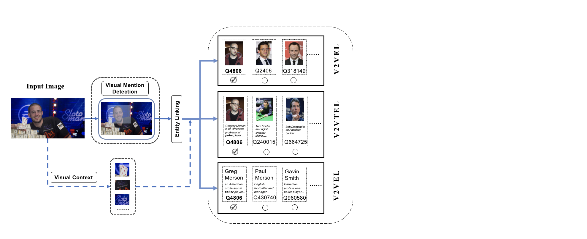

# Visual Named Entity Linking

EMNLP 2022(findings): Visual Named Entity Linking: A New Dataset and A Baseline

## Introduction
VNEL(Visual Named Entity Linking) takes an image as input, then recognize visual mentions with bounding boxes around and links them to the corresponding entities in the large Knowledge Base. As a named entity linking task, it transfers the scenario from the traditonal textual modality to the pure visual modality.

## Sub-tasks



Generally, each entity is often characterized by rich textual and visual descriptions, and each modality of the description can provide sufficient information for visual entity linking. To make the task more clearly presented, we decompose the VNEL task into three sub-tasks(i.e., visual to visual entity linking (V2VEL), visual to textual entity linking (V2TEL), and visual to visual-textual entity linking (V2VTEL)) according to the type of description used in learning entity embeddings. 

- **V2VEL**
  Only the visual description of the entity in KB can be used in the visual entity linking stage. The core of V2VEL is to match two visual objects and some advanced CBIR methods could be adopted to test the performance. 
- **V2TEL**
  Only the textual description of the entity in KB can be used in the visual entity linking stage. The V2TEL task aims to evaluate the ability in image-text matching, central to cross-modal entity linking.
- **V2VTEL**
  Both the visual description and the textual description of the entity in KB could be employed to link the visual mention. The V2VTEL task could leverage both textual and visual modality to complement each other in linking visual mentions.

** We also build a VNEL leaderboard and we will publish it later. 
<!-- https://jqhlgsxvmn.github.io/JQHlGSXvMN-github.io/** -->

## Datasets

WIKIPerson is a high-quality human-annotated visual person linking dataset focused on Visual Named Entity Linking. Unlike previously commonly-used datasets in entity linking, the mention in WIKIPerson is only an image containing the PERSON entity with its bounding box. The corresponding label identifies a unique entity in Wikipedia. As the most common entity type with relatively low annotating cost, we first focus our research on the PERSON type and use it as data V1.0. We will extend locations, yachts, and other more diverse types of the entity in the future.


Notice that our dataset is labeled on the News-related dataset with diverse agencies such as USA TODAY, BBC, the Washington Post, and so on, which means the quality of the image is much higher than the image that is directly searched by search engine. 

## Dataset Example

The covered entity in the images is diverse with different occupations, ages, countries, and so on. Besides, it is also consistent with long-tail distribution which requires higher linking ability.


## Getting Data

**To access our dataset, please refer to this** [WIKIPerson_Kaggle](https://www.kaggle.com/datasets 93a786232004244042464295be2cd68cd43a9dfa00b9d17d339b40171cfa6bdf). A detailed elaboration on the data format and information can be viewed via the link. Notice there are much entity in the Large Knowledge Base are unseen in the input images, so a general Feature Extraction Model is desired in this task. 

|                 | *#Image* | *#Coverd Entity* | *#Knowledge Base* |
| --------------- | -------- | ---------------- | ----------------- |
| WIKIPerson_V1.0 | 48k      | 13K              | 120K              |

## Legal Notices

Any contributors grant you a license to the WIKIPerson Dataset and other content in this repository under the under the [MIT License](https://opensource.org/licenses/MIT), see the LICENSE.md file.

Any contributors reserve all other rights, whether under their respective copyrights, patents, or trademarks, whether by implication, estoppel or otherwise.

## Citation

If you find our work useful, please consider citing our paper:
<!-- ```
@article{chen2022corpusbrain,
  title={CorpusBrain: Pre-train a Generative Retrieval Model for Knowledge-Intensive Language Tasks},
  author={Chen, Jiangui and Zhang, Ruqing and Guo, Jiafeng and Liu, Yiqun and Fan, Yixing and Cheng, Xueqi},
  journal={arXiv preprint arXiv:2208.07652},
  year={2022}
}
``` -->