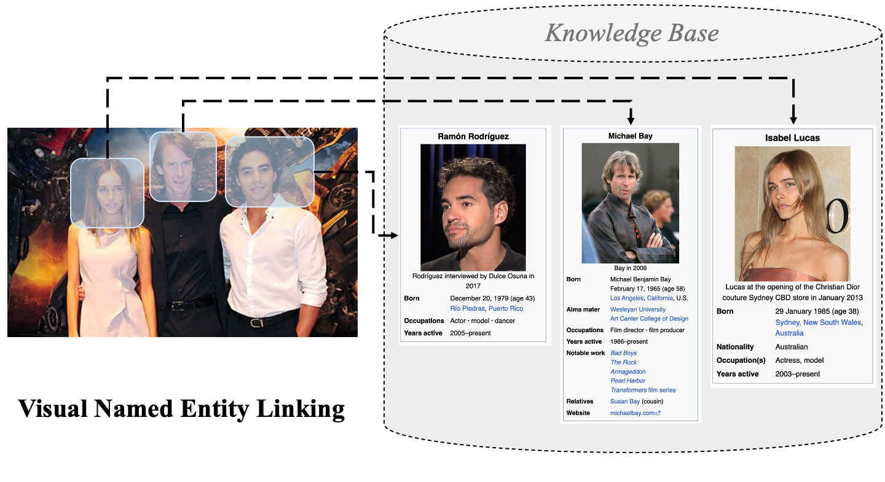

<!--
 * @Author: swx6868752 swx6868752@163.com
 * @Date: 2022-11-10 14:50:32
 * @LastEditors: swx6868752 swx6868752@163.com
 * @LastEditTime: 2023-04-16 22:11:38
 * @FilePath: /ChatgptInTable/Users/jerrysun/Downloads/VNEL-main/README.md
 * @Description: 这是默认设置,请设置`customMade`, 打开koroFileHeader查看配置 进行设置: https://github.com/OBKoro1/koro1FileHeader/wiki/%E9%85%8D%E7%BD%AE
-->
# Visual Named Entity Linking
This repository contains the dataset and code for the EMNLP2022 paper Visual Named Entity Linking: A New Dataset and A Baseline, which is the first large-scale visual input-oriented multimodal named entity linking dataset. The whole dataset contains over 48k annotated images based on 120k Wikipedia knowledge base.

## Task introduction
VNEL(Visual Named Entity Linking) takes an image as input, then recognize visual mentions with bounding boxes around and links them to the corresponding entities in the large Knowledge Base. As a named entity linking task, it transfers the scenario from the traditonal textual modality to the pure visual modality.



## Dataset
WIKIPerson is a high-quality human-annotated visual person linking dataset focused on Visual Named Entity Linking. Notice that our dataset is labeled on the News-related dataset with diverse agencies such as USA TODAY, BBC, the Washington Post, and so on, which means the quality of the image is much higher than the image that is directly searched by search engine. 

### Dataset Example

The dataset contains each image with the entity's bounding box and the corresponding wikidata id. released json data could be found on released _data folder. However, if you want to get access to the full image data, please check the following website.


### Getting Data
**To access our dataset, please refer to this on kaggle** [WIKIPerson_Kaggle](https://www.kaggle.com/datasets/93a786232004244042464295be2cd68cd43a9dfa00b9d17d339b40171cfa6bdf). A detailed elaboration on the data format and information can be viewed via the link. Notice there are much entity in the Large Knowledge Base are unseen in the input images, so a general Feature Extraction Model is desired in this task. 

|                 | *#Image* | *#Coverd Entity* | *#Knowledge Base* |
| --------------- | -------- | ---------------- | ----------------- |
| WIKIPerson_V1.0 | 48k      | 13K              | 120K              |

### Legal Notices
Any contributors grant you a license to the WIKIPerson Dataset and other content in this repository under the under the [MIT License](https://opensource.org/licenses/MIT), see the LICENSE.md file.

Any contributors reserve all other rights, whether under their respective copyrights, patents, or trademarks, whether by implication, estoppel or otherwise.

## Model
We can solve this task by dividing it into two parts, entity recall and entity disambiguation, based on named entity linking on traditional texts. The entity recall based on image similarity, and the entity disambiguation based on image entity context and entity meta information. Especially for current cross-modal models, we find that the capabilities at the fine-grained entity level are far from satisfactory. More information could be seen on [VNEL](https://aclanthology.org/2022.findings-emnlp.178/).


## Citation

If you find our work useful, please consider citing our paper:
```
@article{sun2022VNEL,
  title={Visual Named Entity Linking: A New Dataset and A Baseline},
  author={Sun, Wen  and Fan, Yixing  and Guo, Jiafeng  and Zhang, Ruqing  and Cheng, Xueqi},
  journal={Findings of EMNLP 2022},
  year={2022}
}
```